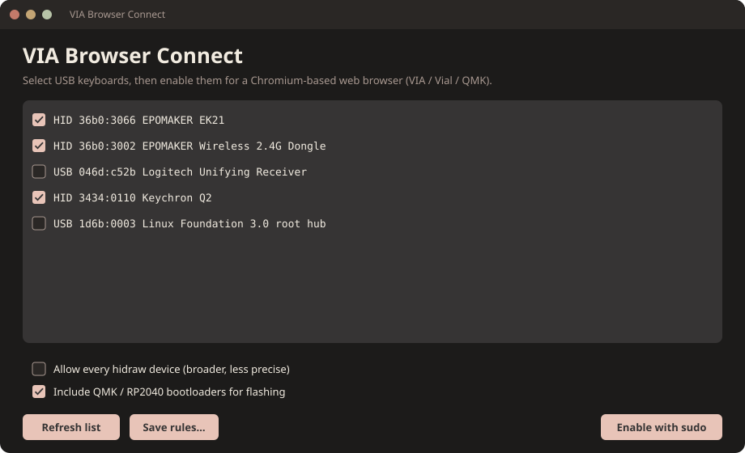
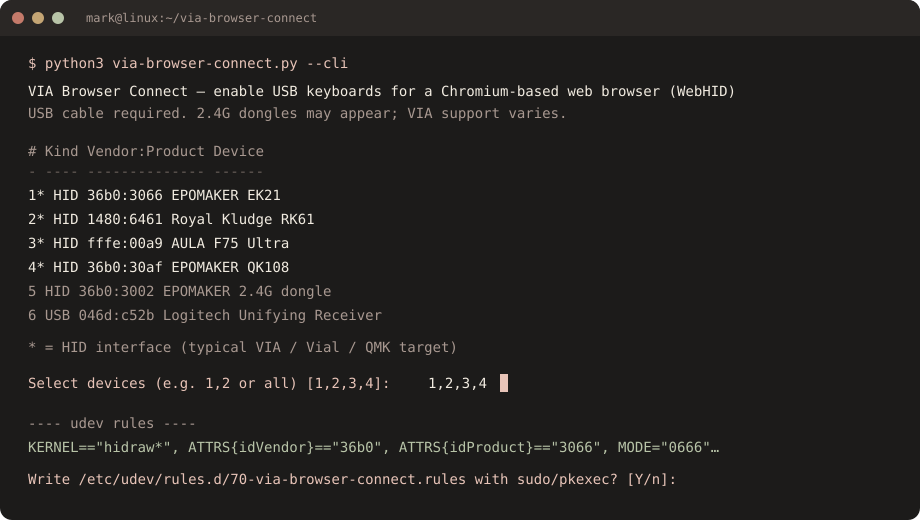

# VIA Browser Connect

Linux helper that writes udev rules so a Chromium-based web browser can open USB keyboards through WebHID. Use it for [VIA](https://usevia.app), [Vial](https://vial.rocks), and Keychron Launcher.

No pip packages. Python 3 + sudo (or pkexec) is enough.

AI coded with human review.

## Screenshots

GUI (Olivia Dark):



CLI:



## Run

Clone the **whole** repo (this is not a single-file copy):

```bash
git clone https://github.com/homerjatmoes/via-browser-connect.git
cd via-browser-connect
python3 via-browser-connect.py
```

The launcher needs `vbc_cli.py`, `vbc_gui.py`, `vbc_devices.py`, `vbc_rules.py`, and `vbc_desktop.py` beside it. If you copy only `via-browser-connect.py`, the next run will try to download those helpers next to it.

No display? Use the prompt:

```bash
python3 via-browser-connect.py --cli
```

Other flags:

```bash
python3 via-browser-connect.py --scan          # list USB devices
python3 via-browser-connect.py --all           # allow every hidraw node
python3 via-browser-connect.py --dry-run --cli # print rules, do not install
python3 via-browser-connect.py --install-menu  # add to the application menu
python3 via-browser-connect.py --remove-menu   # remove the launcher
```

If the GUI fails to start, install `python3-tk` or use `--cli`.

## Application menu

GNOME, KDE Plasma, XFCE, Cinnamon, MATE, LXQt, COSMIC, and most Wayland launchers (rofi, fuzzel, wofi) all use the same XDG `.desktop` file. No extra per-desktop scripts.

From the GUI, click **Add to app menu**, or:

```bash
python3 via-browser-connect.py --install-menu
```

That writes:

- `~/.local/share/applications/via-browser-connect.desktop`
- `~/.local/share/icons/hicolor/scalable/apps/via-browser-connect.svg`

Then search **VIA Browser Connect** in Activities, Kickoff, Whisker, or your launcher. Log out/in only if an older desktop does not pick it up immediately.

## After it installs

1. Unplug and replug each keyboard (or 2.4G dongle).
2. Fully quit the Chromium-based web browser and reopen it. Snap-packaged browsers often ignore udev — use a `.deb` or distro package.
3. Open [usevia.app](https://usevia.app) and authorize the device.

Rules are written to `/etc/udev/rules.d/70-via-browser-connect.rules` (must sort before `73-seat-late.rules`).

## EPOMAKER notes

| Device | VID:PID |
| --- | --- |
| EK21 wired | `36b0:3066` |
| Wireless 2.4G dongle | `36b0:3002` |

Those are different products. If the browser logs `NotAllowedError` on **Wireless 2.4G Dongle**, select that receiver in this script (or allow every hidraw device), then replug the dongle.

EPOMAKER VIA support is often **wired USB only**. If permissions are fixed and VIA still fails, switch the board off 2.4G / Bluetooth and plug in a cable.

## `NotAllowedError: Failed to open the device`

That is a Linux hidraw permission error, not a VIA JSON problem. Re-run this script so the matching VID:PID is in the rules, replug, restart the Chromium-based web browser. Check `chrome://device-log/` for HID lines.

## License

[GNU General Public License v3.0](LICENSE)
